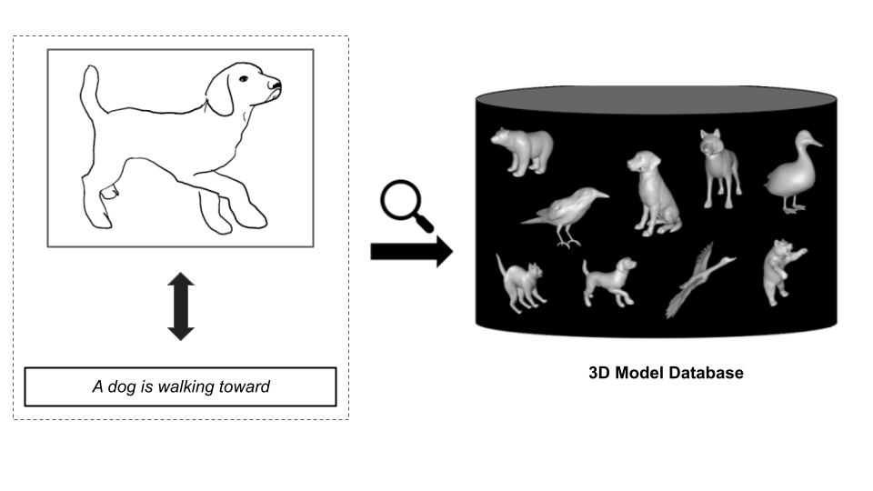
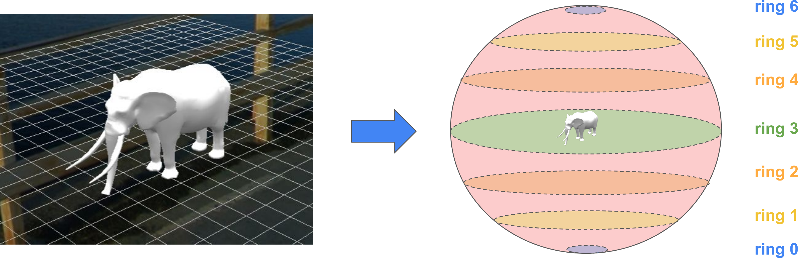
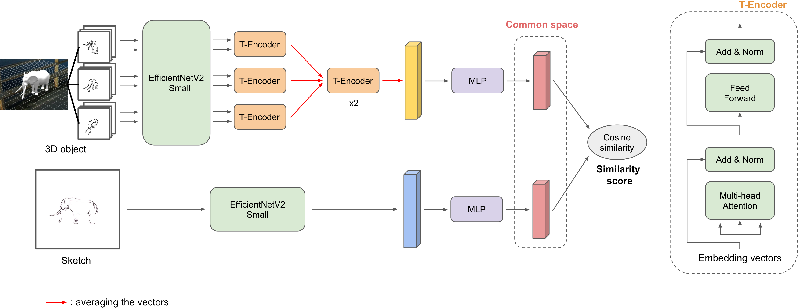
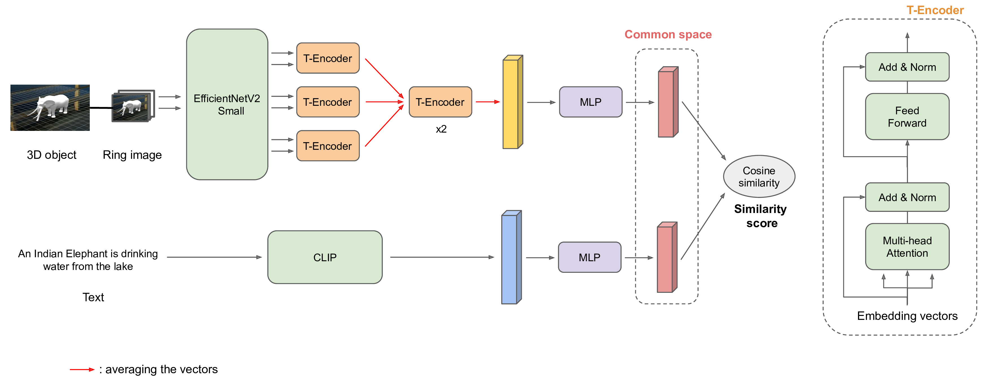

# SHREC2023 - Team TikTorch

This repository contains the sources code of our team (Tiktorch) for track 2 and 3 of the [SHREC2023 challenge](https://www.shrec.net/), a competition that evaluates how well computer algorithms can recognize and retrieve 3D shapes based on different types of input, such as sketches or text description.

<div>
<p align="center">

</p>
</div>

Our team achieved the best performance in both tracks for the topic of **Sketch-based and Text-based 3D Animal Fine-Grained Retrieval** with the following results:
<table class="tg">
<thead>
  <tr>
    <th class="tg-7btt" rowspan="2">Track</th>
    <th class="tg-7btt" colspan="4">Public test</th>
    <th class="tg-7btt" colspan="4">Private test</th>
  </tr>
  <tr>
    <th class="tg-c3ow">NN</th>
    <th class="tg-c3ow">P@10</th>
    <th class="tg-c3ow">NDCG</th>
    <th class="tg-c3ow">mAP</th>
    <th class="tg-c3ow">NN</th>
    <th class="tg-c3ow">P@10</th>
    <th class="tg-c3ow">NDCG</th>
    <th class="tg-c3ow">mAP</th>
  </tr>
</thead>
<tbody>
  <tr>
    <td class="tg-c3ow">2 (Sketch-based)</td>
    <td class="tg-c3ow">0.533</td>
    <td class="tg-c3ow">0.280</td>
    <td class="tg-c3ow">0.708</td>
    <td class="tg-c3ow">0.570</td>
    <td class="tg-c3ow">0.470</td>
    <td class="tg-c3ow">0.255</td>
    <td class="tg-c3ow">0.665</td>
    <td class="tg-c3ow">0.512</td>
  </tr>
  <tr>
    <td class="tg-c3ow">3 (Text-based)</td>
    <td class="tg-c3ow">0.520</td>
    <td class="tg-c3ow">0.220</td>
    <td class="tg-c3ow">0.651</td>
    <td class="tg-c3ow">0.527</td>
    <td class="tg-c3ow">0.460</td>
    <td class="tg-c3ow">0.238</td>
    <td class="tg-c3ow">0.647</td>
    <td class="tg-c3ow">0.525</td>
  </tr>
</tbody>
</table>

Content:

1. [Solution overview](#1-overview)
2. [Install dependencies](#2-install)
3. [Preparing the data](#3-data)
4. [Training](#4-training)
    
    4.1. [For sketch-based (track 2)](#4-1-sketch)

    4.2. [For text-based (track 3)](#4-2-text)

5. [Retrieval](#5-retrieval)

    5.1. [For sketch-based (track 2)](#5-1-sketch)
    
    5.2. [For text-based (track 3)](#5-2-text)

6. [Ensemble the query results](#6-ensemble)
7. [References](#7-refs)

## 1. Solution overview
<span id='1-overview'></span>

Our main approach to the both track (sketch-based and text-based) animal retrieval task is considering it as a **contrastive learning problem**. From two different domains (3D objects and 2D sketches/prompt), we try to learn embedding vectors for both objects
and queries in a common vector space, in which the embedding vectors of similar objects and sketches should be closer to each other and vice versa. The similarity score between
an object and a sketch can be computed by **cosine similarity** metric of their embedding vectors.

We process the 3D objects with the multi-view method. Each 3D object is represented by a set of 7 rings, each ring holds a collection of images of the object, which are captured
while moving a camera around it along a specific trajectory. The illustration for this idea can be seen in the figure below.

<div>
<p align="center">

</p>
</div>


In order to help the model learning better, we generate a moderate amount of new queries and corresponding results. For sketch-based track, we apply Canny edge detection and a wonderful model [Artline](https://github.com/vijishmadhavan/ArtLine) to create the sketches.

The overall architecture of our method is presented in the figures below. We will build two feature extractors, one for objects and one for queries (sketches and prompts). From these extractors, we obtain two feature vectors with U and V dimensions, respectively (U and V can be different). They will be embedded to the common vector space with P dimensions by two Multi-layer Perceptron (MLP) networks. The contrastive loss we use for simultaneous learning the parameters for the both models is a customized version of Normalized Temperature-scaled Cross Entropy Loss (NT-Xent).

<div>
<p align="center">

</p>
<p align="center">Architecture for sketch-based (track 2)</p>
</div>

<div>
<p align="center">

</p>
<p align="center">Architecture for text-based (track 3)</p>
</div>

You can read more about our solutions in these working note papers: [(Track 2)](https://drive.google.com/file/d/1QlRRWnV6_J0RqdcprvNOSMMAL1Qd3hkh/view?usp=sharing), [(Track 3)](https://drive.google.com/file/d/13beu0FjRTQejgDFxxga_bN0st8sK-wKp/view?usp=sharing).

## 2. Install dependencies
<span id='2-install'></span>

Before installing the repo, we need to install the CUDA driver version >=11.6

We will create a new conda environment:

```bash
$ conda env create -f animar.yml
$ conda activate animar
$ pip install utils/pointnet2_ops_lib/.
```
## 3. Preparing the data
<span id='3-data'></span>

From the original data provided by the challenges's organizer, let's follow the [official baseline repository](https://github.com/nhtlongcs/SHREC23-ANIMAR-BASELINE) to generate the "ringview" images of 3D objects (folder `generated_models`). 

The folder structure should look like this:

```
SHREC2023-ANIMAR
`─ data/
│  `─ TextANIMAR2023/
│  │  `─ 3D_Model_References/
│  │  │  `─ References/
│  │  `─ Train/
│  │  │  `─ *GT_Train.csv
│  │  │  `─ *Train.csv
|
│  `─ SketchANIMAR2023/
│  │  `─ 3D_Model_References/
│  │  │  `─ References/
|  |  |  `─ generated_models/
│  │  `─ Train/
│  │  │  `─ SketchQuery_Train/
│  │  │  `─ *GT_Train.csv
│  │  │  `─ *Train.csv
`─ ...
```

From the ringview images in folder `generated_models`, we will generate the sketch-like version of them. The result images will be on the folder `generated_sketches`. We will only use these images for training the sketch-based model.

```bash
$ python data/ring_to_sketch.py \
    data/SketchANIMAR2023/Train/generated_models \
    data/SketchANIMAR2023/Train/generated_sketches
```

For generating the new queries for training (including images and csv files (track 2) or texts and csv files (track 3)), you can follow the notebook `data/gen_query.ipynb`. Assume that we have generated and put them in these folders:
- Sketch-based: images folder `data/SketchANIMAR2023/Train/new_skt_query` and 2 csv files `data/csv/new_train_skt.csv`, `data/csv/new_test_skt.csv`.
- Text-based: 2 csv files `data/csv/new_train_tex.csv`, `data/csv/new_test_text.csv`.

Also, in sketch-based track, we will crop the sketch images to ensure that the sketches will be in the center of the images.

```bash
$ python data/crop_sketch_query.py \
    data/SketchANIMAR2023/Train/new_skt_query \
    data/SketchANIMAR2023/Train/cropped_new_skt_query
```

Now, the structure of our data folder will look like this:

```
SHREC2023-ANIMAR
`─ data/
│  `─ TextANIMAR2023/
│  │  `─ 3D_Model_References/
|  |  |  `─ generated_models/
|  |  |  `- ...
│  │  `─ Train/
│  │  │  `─ new_train_tex.csv
│  │  │  `─ new_test_tex.csv
|  |  |  `- ...
│  `─ SketchANIMAR2023/
│  │  `─ 3D_Model_References/
|  |  |  `─ generated_sketches/
|  |  |  `- ...
│  │  `─ Train/
|  |  |  `─ cropped_new_skt_query/
│  │  │  `─ new_train_skt.csv
│  │  │  `─ new_val_skt.csv
`─ ...
```

## 4. Training
<span id='4-training'></span>

Our best results are achieved with the ringview methods. Therefore, we will only mention about the training of theses models. For the pointcloud methods, the commands are very similar.

### 4.1. For sketch-based (track 2)
<span id='4-1-sketch'></span>

Current available options:

- CNN backbone: ResNet (`resnetXX`), EfficientNet (`efficientnet_bX`, `efficientnet_v2_X`)
- View sequence embedder: LSTM/BiLSTM (`bilstm`) or T-Encoder (`mha`)
- Ring sequence embedder: T-Encoder (1 or more blocks)

The MLP network for embedding to common space can be in the shinking (default) or expanding mode.

**NOTE**.
- Add the flag `--reduce-lr` to use the learning rate schedule.

The meaning and default values of arguments:

```bash
$ python train_sketch_ringview.py --help
```

We can use the processed ring-view images for training (`generated_sketches`), or use the default ring-view images (`generated_models`).

For example:

```
$ python train_sketch_ringview.py \
    --view-cnn-backbone efficientnet_v2_s \
    --skt-cnn-backbone efficientnet_v2_s \
    --rings-path data/SketchANIMAR2023/3D_Model_References/generated_sketches \
    --used-rings 2,3,4 \
    --skt-data-path data/SketchANIMAR2023/Train/cropped_new_skt_query \
    --train-csv-path data/csv/new_train_skt.csv \
    --test-csv-path data/csv/new_test_skt.csv \
    --batch-size 2 \
    --epochs 50 \
    --latent-dim 256 \
    --output-path skt_exps \
    --view-seq-embedder mha \
    --num-rings-mhas 2 \
    --num-heads 4 \
    --lr-obj 1e-4 \
    --lr-skt 1e-4
```

The result of training process will be put inside folder `skt_exps/ringview_exp_{num}` (`num` is counted from 0)

### 4.2. For text-based (track 3)
<span id='4-2-text'></span>

Similar to sketch-based, you can read the the meaning and default values of all arguments by running this command:

```bash
$ python train_prompt_ringview.py --help
```

Example for training command:

```bash
$ python train_prompt_ringview.py \
    --view-cnn-backbone efficientnet_v2_s \
    --rings-path data/TextANIMAR2023/3D_Model_References/generated_models \
    --used-rings 2,3,4 \
    --train-csv-path data/csv/new_train_tex.csv \
    --test-csv-path data/csv/new_test_tex.csv \
    --batch-size 2 \
    --epochs 100 \
    --latent-dim 256 \
    --output-path tex_exps \
    --view-seq-embedder mha \
    --num-rings-mhas 2 \
    --num-heads 4 \
    --lr-obj 3e-5 \
    --lr-txt 3e-5
```

The result of training process will be put inside folder `tex_exps/ringview_exp_{num}` (`num` is counted from 0)

## 5. Retrieval
<span id='5-retrieval'></span>

### 5.1. For sketch-based (track 2)
<span id='5-1-sketch'></span>

For example, our training results is in the directory `./skt_exps/ringview_exp_0/` and the test data is in the directory `./data/SketchANIMAR2023/Public Test/`.

Firstly, we will crop the public test sketch images:

```bash
$ python data/crop_sketch_query.py \
    data/SketchANIMAR2023/Public\ Test/Sketches/ \
    data/SketchANIMAR2023/Public\ Test/cropped_sketches
```

Then run the retrieval command:

```
$ python retrieve_sketch_ringview.py \
    --info-json ./skt_exps/ringview_exp_0/args.json \
    --rings-path data/SketchANIMAR2023/3D_Model_References/generated_sketches \
    --obj-csv-path ./data/SketchANIMAR2023/3D_Model_References/References.csv \
    --skt-data-path ./data/SketchANIMAR2023/Public\ Test/cropped_sketches \
    --skt-csv-path ./data/SketchANIMAR2023/Public\ Test/SketchQuery_Test.csv \
    --obj-weight ./skt_exps/ringview_exp_0/weights/best_obj_embedder.pth \
    --skt-weight ./skt_exps/ringview_exp_0/weights/best_query_embedder.pth \
    --output-path skt_predicts
```

The retrieval results will be on the directory `skt_predicts/ringview_predict_{num}`, which contains 2 file: `query_results.json` and `submission.csv`. The json file can be used for ensemble the results later.

### 5.2. For text-based (track 3)
<span id='5-2-text'></span>

This is quite similar to the sketch-based. Assumse that our training results is in the directory `./tex_exps/ringview_exp_1/` and the test data is in the directory `./data/TextANIMAR2023/Public Test/`.

The retrieval command:

```
$ python retrieve_prompt_ringview.py \
    --info-json tex_exps/ringview_exp_1/args.json \
    --rings-path data/TextANIMAR2023/3D_Model_References/generated_models \
    --obj-csv-path data/TextANIMAR2023/3D_Model_References/References/References.csv \
    --txt-csv-path data/TextANIMAR2023/Public\ Test/TextQuery_Test.csv \
    --obj-weight tex_exps/ringview_exp_1/weights/best_obj_embedder.pth \
    --txt-weight tex_exps/ringview_exp_1/weights/best_query_embedder.pth
    --output-path text_predicts
```

The retrieval results will be on the directory `tex_predicts/ringview_predict_{num}` with similar files to the sketch-based.

## 6. Ensemble the query results
<span id='6-ensemble'></span>

We provide the max-voting method to ensemble the query results of models.

For example, the folder `skt_predicts/test1` is currently in these structure:

```
`─ skt_predicts/test1/
│  `─ a_rand_name/
│  │  `─ query_results.json
│  │  `─ ...
│  `─ other_rand_name/
│  │  `─ query_results.json
│  │  `─ ...
|  `─ ...
```

Ensemble results:

```
python utils/ensemble_results.py \
    --input-folder skt_predicts/test1 \
    --output-folder skt_predicts/test1_ensembled
```

After running the above command, we get the result folder `skt_predicts/test1_ensembled` storing 2 files: `query_results.json` and `submission.csv`.

## 7. References
<span id='7-refs'></span>

This repository is based on the [official baseline](https://github.com/nhtlongcs/SHREC23-ANIMAR-BASELINE) of the organizers.
